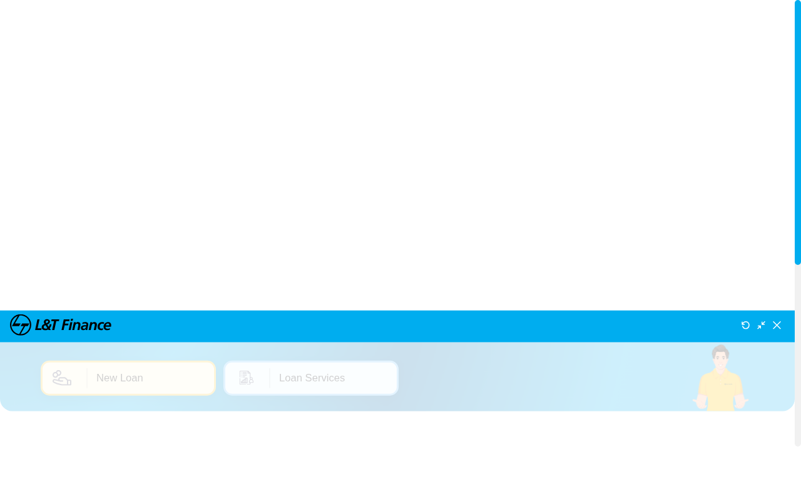

# Ecoutons 🎵

A modern, Spotify-like web application built with React, TypeScript, and Material UI. Ecoutons features a stunning "Liquid Glass" UI, real-time YouTube Music integration, and a fully responsive design.



## ✨ Features

### 🎨 UI & Design
- **Liquid Glass Aesthetic**: A premium dark-mode design with blurred transparencies, glassmorphism effects, and smooth animations.
- **Responsive Layout**: Fully adaptive interface that works seamlessly on desktops, tablets, and mobile devices.
- **Mobile Drawer**: Smooth hamburger menu navigation for smaller screens.

### 🎧 Playback & Audio
- **YouTube Integration**: Powered by the **YouTube Data API v3** and **YouTube Iframe Player API** for a vast library of music.
- **Custom Player**: A persistent bottom player bar with custom controls (Play, Pause, Seek, Volume) that bridges to a hidden YouTube player.
- **Full Screen Mode**: An immersive full-screen player with a blurred dynamic background and a **simulated audio visualizer**.

### 🚀 Functionality
- **Trending Music**: Automatically fetches and displays the latest trending music videos.
- **Real-time Search**: Search for any song or artist directly from YouTube.
- **Library Management**: Create custom playlists and "Like" your favorite songs.
- **Personalization**:
    - **Recently Played**: Tracks your listening history locally.
    - **Recommended for You**: Smart recommendations based on your most-played artists.

## 🛠️ Tech Stack

- **Frontend**: [React](https://react.dev/) (v19), [TypeScript](https://www.typescriptlang.org/)
- **Build Tool**: [Vite](https://vitejs.dev/)
- **UI Framework**: [Material UI (MUI)](https://mui.com/)
- **Styling**: [Emotion](https://emotion.sh/), CSS Modules
- **Animations**: [Framer Motion](https://www.framer.com/motion/)
- **Routing**: [React Router](https://reactrouter.com/)
- **API**: YouTube Data API v3

## 📦 Installation

1.  **Clone the repository**
    ```bash
    git clone https://github.com/DhrubaDC1/ecoutons.git
    cd ecoutons
    ```

2.  **Install dependencies**
    ```bash
    npm install
    ```

3.  **Set up Environment Variables**
    *   Open `src/services/api.ts` (Note: In a production app, use a `.env` file).
    *   Ensure the `API_KEY` is set to your YouTube Data API key.

4.  **Run the development server**
    ```bash
    npm run dev
    ```

5.  **Build for production**
    ```bash
    npm run build
    ```

## 🤝 Contributing

Contributions are welcome! Please feel free to submit a Pull Request.

## 📄 License

This project is open source and available under the [MIT License](LICENSE).
